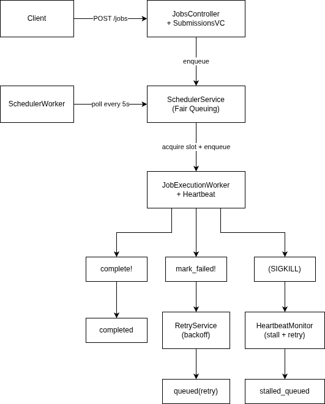
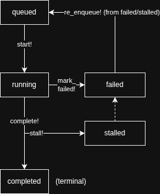

# Design Document

## Architecture

Rails 7 API-only app. MySQL stores all job and client state. Redis is only used for heartbeat keys. Sidekiq handles background processing.

 

(https://drive.google.com/file/d/19cbFNR8Yn3-uJgwTslalfGX_-vm9o-3n/view?usp=drive_link)

Client hits `POST /jobs`, JobSubmissionService saves the job as `queued` and tries to start it right away. If there's a slot open, ConcurrencyGuardService grabs it and hands the job to JobExecutionWorker. There's also a SchedulerWorker running every 5s that picks up retried jobs and fills freed slots.

## Design Choices

### Why DB locks instead of Redis for concurrency

I used `SELECT FOR UPDATE` on the client row to enforce concurrency limits instead of Redis INCR/DECR.

Problem with Redis counters: if a worker gets killed (SIGKILL), the cleanup code never runs, DECR never fires, and that slot is gone forever. With DB, I just count `WHERE status = 'running'`. When the heartbeat monitor stalls a dead job, the count drops on its own. No leaked slots.

Trade-off is a bit more latency per check (DB vs Redis), but correctness matters more here.

### Pessimistic locking on state transitions

AASM is configured with `requires_lock: true`, so every state change does a `SELECT FOR UPDATE` on the job row first. Without this, two workers could both see `status = queued` and both try to start the same job.

One thing I had to work around: `lock!` reloads the record and wipes in-memory changes. So I write things like `last_error` and `scheduled_at` with `update_column` before calling the AASM event.

### Immediate + periodic scheduling

When a job comes in, we try to run it immediately. But there's also a SchedulerWorker that sweeps every 5 seconds as a backup. It catches retried jobs whose backoff just expired, slots that freed up, etc.

### Heartbeat thread

The main Sidekiq thread is blocked doing the actual work, so the heartbeat runs in a separate background thread. It pulses a Redis key every 20s with a 60s TTL. If the process dies, the key just expires on its own and the monitor picks it up.

### Fair queuing approach

If you just sort by priority, one client can starve everyone else by flooding high-priority jobs. So I do priority bands (high, then medium, then low), but round-robin across clients within each band. Everyone gets a turn.

### Retry with `scheduled_at`

Failed jobs go back to `queued` with `scheduled_at = now + 2^attempts` seconds. The scheduler already skips jobs with a future `scheduled_at`, so this just works without any extra logic. Backoff prevents hammering on transient failures.

## Scaling to 100k Jobs/Hour

100k/hour = ~28 jobs/sec.

Redis is fine. It only holds heartbeat keys for running jobs, so it barely gets any traffic even at full load.

The bottleneck is the DB. `ConcurrencyGuardService` locks the client row on every slot acquisition, so if most jobs belong to the same client, they all serialize on that one row. With enough clients it's spread out and MySQL handles it fine (each lock is held for <5ms). If it becomes a problem, I'd shard by splitting clients into sub-pools so the contention spreads across rows.

Right now the scheduler and execution workers run in the same Sidekiq process. To scale, I'd split them into separate processes: `sidekiq -q scheduler -c 2` for the lightweight scheduling loop and `sidekiq -q execution -c 20` for running jobs. The workers already use different queues so it's just a deployment change.

For multiple machines, `client_id % shard_count` can route jobs to machine-specific queues so each machine only locks its own clients.

## Failure Modes

### What happens if Redis loses all keys (FLUSHALL)?

All heartbeat keys disappear. The monitor sees running jobs with no heartbeat and stalls all of them, including the ones that are actually fine. The healthy workers finish their work and try to call `complete!`, but AASM rejects it because the job is `stalled` now, not `running`. They just log the error and exit.

The stalled jobs get retried with backoff. Workers start writing fresh heartbeat keys. No data is lost because MySQL has all the job state. But some jobs might run twice since the original worker was still running when the retry started. Workloads need to be idempotent to handle this.

### Split-brain: two workers try to stall the same job

AASM handles this. Both try `stall!`, one succeeds, the other gets `AASM::InvalidTransition`. We rescue that exception and ignore it.

Same thing for two workers trying to start the same job. `ConcurrencyGuardService` locks the client row, AASM locks the job row. Only one `start!` goes through.

There's also a `locked_by` check. When a worker picks up a job that's already running, it does `UPDATE WHERE locked_by LIKE 'scheduler:%'`. If another worker already took over, zero rows match and it gives up.

### Frozen worker (2+ minute GC pause)

The heartbeat thread is in the same process, so it freezes too. After 60s the Redis key expires. Monitor stalls the job, retries it.

When the worker unfreezes it tries to `complete!` but the job is already `stalled`, so AASM rejects it. If the freeze is under 60s, the TTL hasn't expired yet so nothing happens.

## Abuse Protection

The concurrency limit already caps how many jobs run per client. Even if someone queues a million jobs, only `concurrency_limit` run at a time. The rest sit in `queued`. Round-robin scheduling means other clients still get their turns.

I also added a hard cap of 10k queued jobs per client. After that the API returns 429. In production I'd put `rack-attack` in front for request-level rate limiting and add API key auth.
